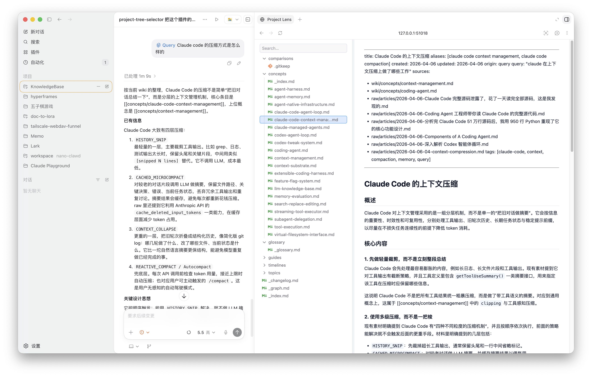

# Project Lens

Project Lens is a local Codex plugin that opens the current workspace as an interactive file tree inside Codex's in-app browser. It is built for quickly browsing a project, selecting files, previewing source and Markdown content, and seeing Git status without leaving the Codex workflow.



The screenshot above shows Project Lens embedded next to an active Codex conversation. The left pane renders the project tree with search, folders, file icons, and Git status indicators. The right pane previews the selected file, including Markdown rendering and syntax-highlighted source views.

## Features

- Interactive project tree powered by [`@pierre/trees`](https://trees.software)
- Searchable, compact file browser for the current workspace
- Read-only file preview API
- Markdown preview with GitHub-flavored Markdown support
- Syntax highlighting for common source formats
- Git status badges for changed, added, deleted, renamed, and untracked files
- Live refresh through Server-Sent Events when project files change
- MCP tools for starting, checking, and stopping the local browser service

## How It Works

Project Lens is packaged as a Codex plugin:

- `.codex-plugin/plugin.json` describes the plugin metadata, skills, MCP servers, and Codex UI information.
- `.mcp.json` registers the local MCP server.
- `src/mcp-server.js` exposes the `project_lens_start`, `project_lens_status`, and `project_lens_stop` tools.
- `src/web-server.js` starts a localhost HTTP server, serves the built web app, and exposes `/api/tree`, `/api/file`, and `/api/events`.
- `web/src/main.jsx` implements the React interface and renders the file tree with [`@pierre/trees`](https://trees.software).
- `skills/open-project-lens/SKILL.md` tells Codex how to start the service and open it in the in-app browser.

## Requirements

- Node.js 18 or newer
- npm
- Codex with local plugin support

## Install Dependencies

```bash
npm install
```

## Build

Build the web UI before using the plugin through Codex:

```bash
npm run build
```

The MCP server expects `dist/index.html` to exist. If the build output is missing, the server will ask you to run `npm install && npm run build`.

## Run Locally

Start the standalone web server:

```bash
npm start
```

The command prints a local URL like:

```text
Project Lens: http://127.0.0.1:51018/
Root: /path/to/project
```

You can also choose the project root and port explicitly:

```bash
PROJECT_TREE_ROOT=/path/to/project PROJECT_TREE_PORT=51018 npm start
```

## Install in Codex

This repository already includes the files Codex needs for a local plugin install:

- `.codex-plugin/plugin.json`
- `.mcp.json`
- `skills/open-project-lens/SKILL.md`
- `.agents/plugins/marketplace.json`

To install it in Codex:

1. Build the plugin:

   ```bash
   npm install
   npm run build
   ```

2. Make sure the local marketplace entry points to this repository. The included `.agents/plugins/marketplace.json` registers `project-lens` from the current directory:

   ```json
   {
     "name": "project-lens",
     "source": {
       "source": "local",
       "path": "."
     },
     "policy": {
       "installation": "AVAILABLE",
       "authentication": "ON_INSTALL"
     },
     "category": "Productivity"
   }
   ```

3. Open Codex, go to the plugin or extensions area, and install **Project Lens** from the local marketplace.

4. Start a Codex conversation in the workspace you want to browse and ask:

   ```text
   Open Project Lens.
   ```

   Codex will call the plugin's MCP tool, start the local server, and open the returned localhost URL in the in-app browser.

For a home-local plugin setup, place an equivalent marketplace entry in `~/.agents/plugins/marketplace.json` and set the `path` to this repository path.

## MCP Tools

The plugin exposes three MCP tools:

| Tool | Purpose |
| --- | --- |
| `project_lens_start` | Starts the local web app and returns the browser URL. |
| `project_lens_status` | Reports whether the web app is running and which root it is browsing. |
| `project_lens_stop` | Stops the local web app. |

`project_lens_start` accepts an optional `root` argument. When installing this as a home-local plugin, pass the current Codex workspace path as `root` so the tree opens the active project instead of the plugin directory.

## Development

Run the Vite development server:

```bash
npm run dev
```

Run the MCP server directly:

```bash
npm run mcp
```

Build production assets:

```bash
npm run build
```

## Notes

Project Lens is read-only from the browser UI. It reads directory entries and file contents through the local server, but it does not write, edit, delete, or move project files.
